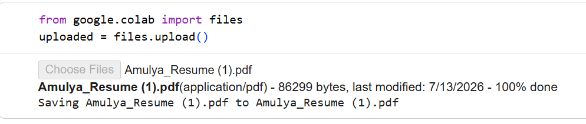
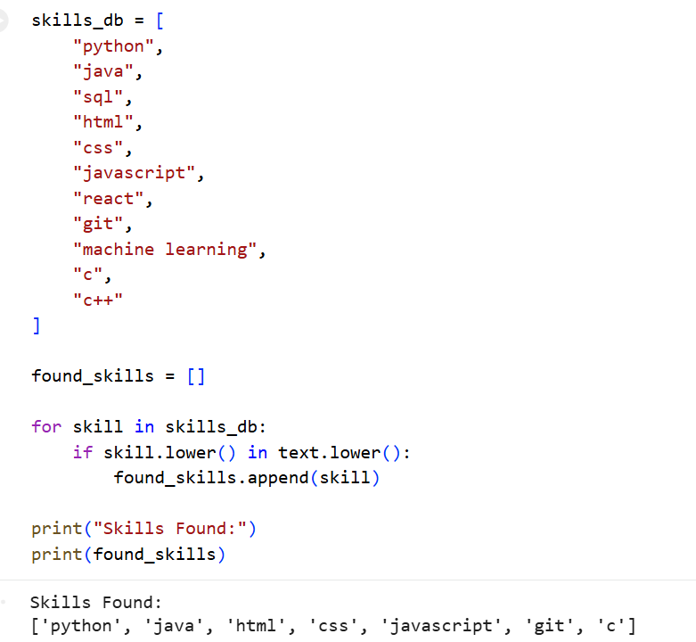
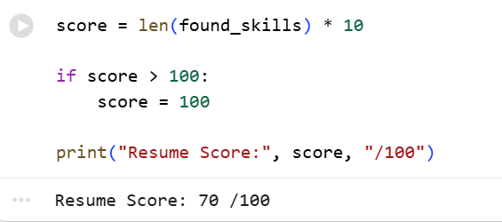
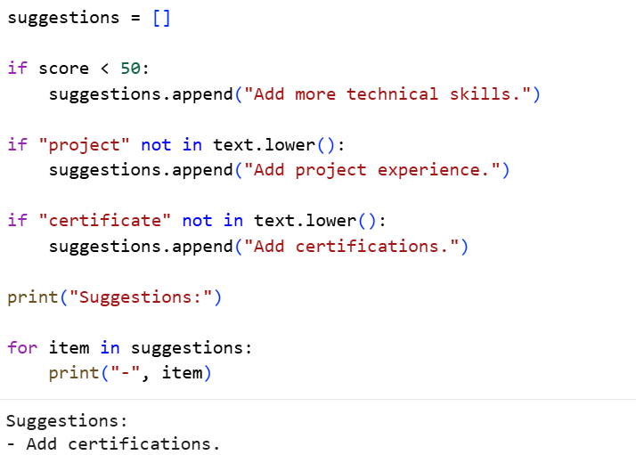

# AI Resume Analyzer

## Overview
AI Resume Analyzer is a Python-based tool that extracts text from PDF resumes, identifies technical skills, calculates a resume score, and provides personalized improvement suggestions.

## Features
- PDF Resume Upload
- Skill Detection
- Resume Scoring
- Improvement Suggestions

## Technologies Used
- Python
- Google Colab
- PyPDF2

## Workflow
1. Upload Resume PDF
2. Extract Resume Text
3. Detect Technical Skills
4. Calculate Resume Score
5. Generate Suggestions

## Sample Output

Resume Score: 70/100

Skills Found:
- Python
- Java
- HTML

Suggestions:
- Add certifications
- Add more projects

## Future Enhancements
- AI-powered feedback using Gemini API
- Job-role based resume matching
- Resume ranking system
  ## Screenshots

### Resume Upload

### Skills Detection

### Resume Score

### Suggestions

